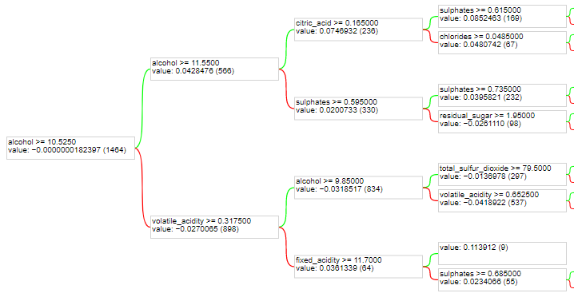

# TensorFlow Decision Forests inference on Arduino

This project trains a ML model with the [TensorFlow Decision Forests](https://www.tensorflow.org/decision_forests) library, and exports it to an [Arduino](https://www.arduino.cc/) with 32k of Flash and 2k of RAM.
 
The model is trained to predicts the quality (between 0 and 10) of red wine using measures of physical characteristics (e.g. pH, fixed volatile and citric acidities, sugar, sulphates, etc.). The training is done using wine expert annotations from the [Wine Quality's UCI ML repository](https://archive.ics.uci.edu/ml/datasets/Wine+Quality). The model is a small regressive Gradient Boosted Trees with 20 trees. The first of these trees looks as follow:

 
## How it works

1. Train and evaluate a model with TF-DF (in python).
1. Export the model into a compact binary format (converter written in python).
1. Store the model binary data in a `.h` file compatible with the Arduino compiler.
1. Compile and upload the model data and inference code on an Arduino.
1. Run the model on the Arduino.
 
The model is stored in the Arduino's Flash memory. During inference, each tree is copied to RAM, run and discarded. The final prediction is the sum of the tree individual predictions.
 
## Usage example
 
1. Install Python>=3.7 and TensorFlow Decision Forests: `pip3 install tensorflow_decision_forests -U`.
1. Run `python3 train_model.py` to train and export the model to `run_model/exported_model.h`. Note: This file already exist in the repot.
1. Compile and upload `run_model/run_model.ino` to an Ardwino. A usage example of the model is available in `run_model.ino`. The model prediction is printed on the Serial monitor.
 
## Constraints
 
This library has a few limitations:
 
- Only support for Gradient Boosted Trees model with one output dimension e.g. binary classification, regression.
- Does not apply the linking / activation function of the model i.e. returns logit in case of binary classification (instead of a probability).
- Only support for numerical features. No support for categorical or categorical-set features.
- Limited to a maximum of 32k nodes per tree. Note: Each node takes 8  bytes of flash memory, so you'll probably run out of memory before that.

## Binary model format

See `run_model/exported_model.h` for an example of binary model.
 
The model binary data contains three parts:

1. The model header (stored in RAM).
1. The tree structure stored as a list of nodes (stored in flash; one for each tree).
1. The address and size of the node list of each tree (stored in RAM).

### Header
 
| Size, bytes | Description |
|----|---|
| 2 | Format version |
| 2 | Number of trees, <num_trees> |
| 2 | Number of nodes, <num_nodes> |

Stored in Model::header.
 
### Node list address and size
 
| Size, bytes | Description |
|----|---|
| 2 x <num_trees> | Address of node list in flash memory |

Stored in Model::trees.
 
| Size, bytes | Description |
|----|---|
| 2 x <num_trees> | Number of nodes |

Stored in Model::num_nodes.
 
### Node list (one for each tree)
 
| Size, bytes | Description |
|----|---|
| 8 x <num_nodes> | The node data |

Indirectly stored in Model::trees.
 
Each node data is as follow:
 
| Size, bytes | Description |
|----|---|
| 2 | [if the node is not a leaf] Index offset to the positive child node. [if the node is a leaf] value 0. Note: The negative child node is always the next node. |
| 2 | [if the node is not a leaf] Index of the input feature tested by the node. [if the node is a leaf] Not used. |
| 4 | Float. [if the node is a leaf] Value of the leaf. [if the node is not a leaf]  Threshold of the test. |
 
Integer values are stored in little endian. This model format is inspired from [Yggdrasil Decision Forests](https://github.com/google/yggdrasil-decision-forests/blob/main/yggdrasil_decision_forests/serving/decision_forest/decision_forest.h).
